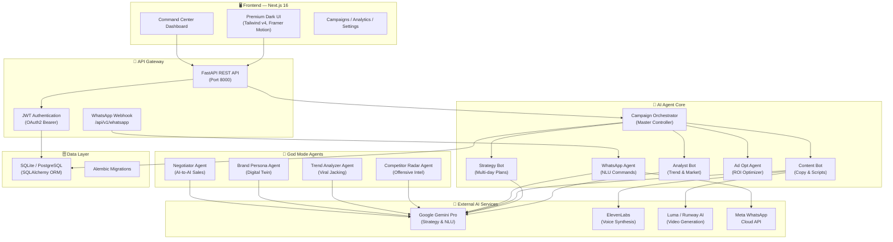
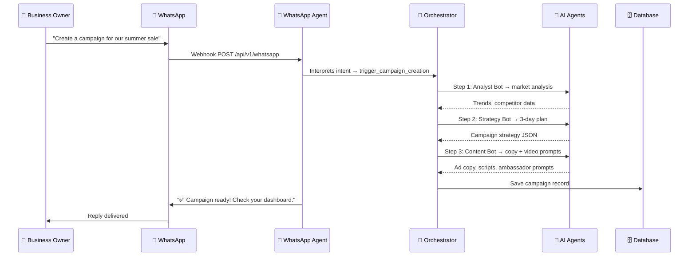
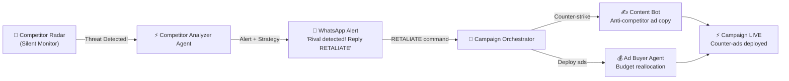

<div align="center">

<h1>⚡ SellSenseAI</h1>

<p>
  <strong>The World's First God-Tier Autonomous AI Marketing Command Center</strong><br/>
  Built for Founders. Powered by Gemini. Designed to Win.
</p>

<p>
  
  
  
  
  
  
</p>

<p>
  <a href="#-features">Features</a> •
  <a href="#-architecture">Architecture</a> •
  <a href="#-tech-stack">Tech Stack</a> •
  <a href="#-god-mode">God Mode</a> •
  <a href="#-getting-started">Getting Started</a> •
  <a href="#-api-reference">API Reference</a>
</p>

</div>

---

## 📖 Overview

**SellSenseAI** is a next-generation, multi-agent AI marketing platform built for modern businesses. It doesn't just assist with marketing — it **autonomously executes** entire marketing campaigns, **retaliates against competitors**, **maintains a persistent brand identity**, and **negotiates sales deals with other AI agents** (Agentic Commerce).

> 🏆 _"From a single business description, SellSenseAI generates a complete marketing strategy, creates ad copy, produces AI video content with a consistent digital brand ambassador, buys ad placements, tracks performance, and adapts — completely on autopilot."_

---

## ✨ Features

### 🤖 Core AI Agent Suite

| Agent | Role | Description |
|-------|------|-------------|
| **Analyst Bot** | 📊 Market Intelligence | Scans real-time trends, competitor activity, and market signals |
| **Strategy Bot** | 🧠 Campaign Planner | Generates multi-day, multi-platform marketing strategies |
| **Content Bot** | 🎬 Media Creator | Writes ad copy, scripts, video prompts, and voiceovers |
| **Ad Opt Agent** | 💰 Media Buyer | Autonomously manages ad spend, A/B tests, and ROI optimization |
| **WhatsApp Agent** | 📱 Owner Interface | Natural language command center via WhatsApp |
| **Trend Analyzer** | 🔥 Viral Intelligence | Identifies viral trends and scores them for your niche |
| **Competitor Agent** | ⚔️ Offensive Engine | Monitors rivals and triggers counter-attack campaigns |
| **Brand Persona Agent** | 👤 Identity Manager | Selects and maintains a persistent AI brand ambassador |
| **Negotiator Agent** | 🤝 AI Sales Closer | Negotiates deals with other AI agents autonomously |

---

### 🎯 Feature Breakdown

#### 1️⃣ Autonomous Omnichannel Execution
- One-click campaign creation spanning Instagram, LinkedIn, Twitter, Reels, Stories
- Multi-day action plan with timed content calendar  
- AI-generated copy, hashtags, and posting strategies per platform
- Auto-pilot toggle for fully autonomous execution

#### 2️⃣ AI Video & Audio Generation
- **Luma / Runway AI** video prompt generation with cinematic directing instructions
- **ElevenLabs** voiceover synthesis from AI-generated scripts
- Integrated video and audio players in the campaign detail dashboard
- Face-consistency prompts for persistent brand ambassador identity

#### 3️⃣ Trend-Jacking & Competitor Intelligence
- Real-time trend detection engine with virality scoring
- "Market Pulse" live dashboard widget showing trending topics
- Proactive WhatsApp alerts: _"[Trend] is viral — Want me to capitalise on it?"_
- Silent competitor monitoring for rival ad launches, price drops, and flash sales
- **God's Eye Competitor Radar** widget with retaliation strategy buttons

#### 4️⃣ Autonomous Ad Buying & Optimization
- AI-managed daily ad budget allocation
- Automated A/B testing between creative variations
- Real-time performance metrics: ROI, CTR, CPC, Impressions
- AI agent insight bubble: _"Variation B outperforming. Reallocating budget in 4h."_

#### 5️⃣ WhatsApp / Telegram Owner Mode
- Control your entire marketing empire from a WhatsApp message
- Business Intelligence queries: _"What were my sales today?"_
- Voice-to-action: send a voice note → trigger a full campaign
- Daily Morning Briefing delivered at 8am automatically
- Retaliation mode: reply "RETALIATE" to launch a counter-strike campaign

---

### 👑 God Mode Features

#### ⚔️ Phase 1: God's Eye Competitor Radar
A silent, always-on offensive intelligence engine that monitors rivals in real time.

#### 👤 Phase 2: Persistent AI Brand Ambassadors
Your brand now has a **face**. Select from AI personas (Sarah — Professional, Leo — Gen Z) that appear consistently across every AI-generated video via strict face-consistency prompting.

#### 🤖 Phase 3: Agentic Commerce (AI-to-AI Selling)
The final frontier. SellSenseAI can now **sell directly to other AI agents** (future Siri, Gemini Assistant, etc.) using machine-readable JSON-LD negotiation protocols — completely bypassing the human purchasing funnel.

---

## 🏗️ Architecture

### System Architecture Diagram



---

### AI Agent Workflow



---

### God Mode — Competitor Retaliation Flow



---

## 🛠️ Tech Stack

### Backend

| Technology | Version | Purpose |
|-----------|---------|---------|
| **Python** | 3.11+ | Core runtime |
| **FastAPI** | 0.115 | REST API framework with async support |
| **SQLAlchemy** | 2.0 | ORM for database operations |
| **Alembic** | Latest | Database schema migrations |
| **SQLite** | Built-in | Development database (PostgreSQL-ready) |
| **JWT / OAuth2** | via `python-jose` | Secure user authentication |
| **Uvicorn** | Latest | ASGI production server |
| **Google Gemini** | `gemini-2.0-flash` | Core LLM for all AI reasoning |
| **ElevenLabs API** | v1 | AI voiceover synthesis |
| **Luma / Runway AI** | v1 | AI video generation |
| **Meta WhatsApp API** | Cloud API v21 | WhatsApp integration |
| **Pydantic** | v2 | Data validation and schemas |

### Frontend

| Technology | Version | Purpose |
|-----------|---------|---------|
| **Next.js** | 16 | App Router / React framework |
| **TypeScript** | 5 | Type-safe development |
| **Tailwind CSS** | v4 | Utility-first styling |
| **Framer Motion** | 12 | Premium animations and transitions |
| **@studio-freight/lenis** | 1.0 | Silky smooth scrolling |
| **Recharts** | 3 | Analytics data visualizations |
| **Three.js / R3F** | Latest | 3D background effects |
| **Lucide React** | Latest | Icon system |
| **Radix UI** | Latest | Accessible component primitives |
| **GSAP** | 3 | Advanced animation engine |
| **Axios** | 1 | HTTP client for API calls |

---

## 📂 Project Structure

```
SellSenseai/
├── 🐍 backend/
│   ├── app/
│   │   ├── api/
│   │   │   ├── v1/
│   │   │   │   └── endpoints/
│   │   │   │       ├── campaigns.py      # Campaign CRUD + AI trigger
│   │   │   │       ├── whatsapp.py       # WhatsApp webhook handler
│   │   │   │       ├── auth.py           # JWT auth endpoints
│   │   │   │       └── analytics.py      # Performance metrics
│   │   │   └── deps.py                   # Auth dependency injection
│   │   ├── services/
│   │   │   ├── campaign_orchestrator.py  # Master AI pipeline
│   │   │   ├── whatsapp_agent.py         # NLU WhatsApp commander
│   │   │   ├── gemini_service.py         # Gemini LLM integration
│   │   │   ├── video_service.py          # AI video generation
│   │   │   ├── voice_service.py          # ElevenLabs TTS
│   │   │   ├── ad_orchestrator.py        # Ad buying pipeline
│   │   │   ├── ad_opt_agent.py           # A/B test optimizer
│   │   │   ├── competitor_radar.py       # Rival monitoring
│   │   │   ├── competitor_service.py     # Threat detection
│   │   │   ├── competitor_analyzer_agent.py # Retaliation strategy
│   │   │   ├── trend_service.py          # Viral trend discovery
│   │   │   ├── trend_analyzer_agent.py   # Niche relevance scorer
│   │   │   ├── proactive_orchestrator.py # Autonomous briefings
│   │   │   ├── ambassador_service.py     # Digital twin manager
│   │   │   ├── brand_persona_agent.py    # Identity selector
│   │   │   ├── negotiator_agent.py       # AI-to-AI sales closer
│   │   │   ├── agent_commerce_service.py # Agentic commerce protocol
│   │   │   ├── briefing_service.py       # Morning briefings
│   │   │   └── whatsapp_service.py       # WA message sender
│   │   ├── models/
│   │   │   └── sql_models.py             # SQLAlchemy ORM models
│   │   ├── schemas/                       # Pydantic request/response schemas
│   │   ├── core/
│   │   │   └── config.py                 # Environment configuration
│   │   ├── db/
│   │   │   └── session.py                # Database session factory
│   │   └── main.py                       # FastAPI app entry point
│   └── requirements.txt
│
└── ⚛️  frontend/
    ├── src/
    │   ├── app/
    │   │   ├── (dashboard)/
    │   │   │   └── dashboard/
    │   │   │       ├── page.tsx           # Main command center
    │   │   │       ├── campaigns/         # Campaign management
    │   │   │       ├── analytics/         # Performance analytics
    │   │   │       └── settings/          # Owner settings + WhatsApp Mode
    │   │   ├── login/                     # Auth pages
    │   │   └── signup/
    │   ├── components/
    │   │   ├── dashboard/
    │   │   │   ├── AgentStatus.tsx        # Live AI agent status cards
    │   │   │   ├── MarketTrends.tsx       # Market Pulse live widget
    │   │   │   ├── CompetitorRadar.tsx    # God's Eye offensive widget
    │   │   │   ├── AmbassadorGallery.tsx  # Brand persona selector
    │   │   │   ├── CommercePortal.tsx     # AI-to-AI commerce hub
    │   │   │   ├── Sidebar.tsx            # Navigation sidebar
    │   │   │   └── Header.tsx             # Top navigation bar
    │   │   └── ui/                        # Design system components
    │   └── lib/
    │       ├── api.ts                     # Axios API client
    │       └── motion.ts                  # Framer Motion variants
    └── package.json
```

---

## 🚀 Getting Started

### Prerequisites

```bash
- Python 3.11+
- Node.js 20+
- npm / yarn
- Google Gemini API Key (free at ai.google.dev)
```

### 1. Clone the Repository

```bash
git clone https://github.com/your-username/SellSenseai.git
cd SellSenseai
```

### 2. Backend Setup

```bash
cd backend

# Create virtual environment
python3 -m venv venv
source venv/bin/activate  # Windows: venv\Scripts\activate

# Install dependencies
pip install -r requirements.txt

# Configure environment variables
cp .env.example .env
# Edit .env and add your API keys:
# GEMINI_API_KEY=your_key_here
# SECRET_KEY=your_jwt_secret
# ELEVENLABS_API_KEY=your_key (optional)
# WHATSAPP_TOKEN=your_meta_token (optional)

# Run database migrations
alembic upgrade head

# Start the backend server
export PYTHONPATH=$PYTHONPATH:.
uvicorn app.main:app --host 0.0.0.0 --port 8000 --reload
```

### 3. Frontend Setup

```bash
cd frontend

# Install dependencies
npm install

# Start the development server
npm run dev
```

### 4. Access the App

| Service | URL |
|---------|-----|
| 🖥️ **Frontend** | http://localhost:3000 |
| 🔌 **API** | http://localhost:8000 |
| 📚 **API Docs** | http://localhost:8000/api/v1/docs |

---

## 🔑 Environment Variables

```env
# Backend (.env)
DATABASE_URL=sqlite:///./sellsenseai.db
SECRET_KEY=your-super-secret-jwt-key
GEMINI_API_KEY=your-google-gemini-api-key
ELEVENLABS_API_KEY=your-elevenlabs-key       # Optional
WHATSAPP_TOKEN=your-meta-whatsapp-token      # Optional
WHATSAPP_PHONE_ID=your-phone-number-id       # Optional
```

---

## 📡 API Reference

### Authentication
```http
POST /api/v1/auth/register    # Create account
POST /api/v1/auth/login       # Get JWT token
```

### Campaigns
```http
GET    /api/v1/campaigns/           # List all campaigns
POST   /api/v1/campaigns/           # Create new campaign (triggers AI pipeline)
GET    /api/v1/campaigns/{id}       # Get campaign details + AI content
PUT    /api/v1/campaigns/{id}/autopilot  # Toggle auto-pilot mode
GET    /api/v1/campaigns/{id}/content    # Get AI-generated video, audio, copy
GET    /api/v1/campaigns/{id}/performance # Get ad metrics
```

### WhatsApp
```http
GET  /api/v1/whatsapp/webhook   # Meta webhook verification
POST /api/v1/whatsapp/webhook   # Receive WhatsApp messages (Owner Mode)
```

### Agentic Commerce
```http
GET  /api/v1/agentic/catalog    # Machine-readable product catalog (JSON-LD)
POST /api/v1/agentic/negotiate  # AI-to-AI negotiation endpoint
```

---

## 🧪 Testing the WhatsApp Integration (Simulation Mode)

Without a live Meta account, you can simulate WhatsApp messages:

```bash
curl -X POST http://localhost:8000/api/v1/whatsapp/webhook \
-H "Content-Type: application/json" \
-d '{
  "object": "whatsapp_business_account",
  "entry": [{
    "changes": [{
      "value": {
        "messages": [{
          "from": "+911234567890",
          "text": { "body": "Create a campaign for our monsoon sale" },
          "type": "text"
        }]
      }
    }]
  }]
}'
```

Watch the backend terminal for the AI orchestrator in action.

---

## 🗺️ Roadmap

- [x] Multi-agent campaign orchestration
- [x] AI video & voice generation
- [x] Competitor radar & retaliation engine
- [x] Persistent AI brand ambassadors
- [x] Agentic Commerce (AI-to-AI selling)
- [x] WhatsApp owner mode
- [ ] Real-time multi-platform ad posting (Meta Ads API)
- [ ] Live ElevenLabs voice synthesis integration
- [ ] Custom LoRA training for brand ambassador face consistency
- [ ] Telegram bot integration
- [ ] Mobile-native app (React Native)

---

## 🤝 Contributing

Contributions are welcome! Please read our contributing guidelines and submit PRs to the `dev` branch.

1. Fork the repository
2. Create your feature branch (`git checkout -b feature/AmazingFeature`)
3. Commit your changes (`git commit -m 'Add AmazingFeature'`)
4. Push to the branch (`git push origin feature/AmazingFeature`)
5. Open a Pull Request

---

## 📄 License

Distributed under the MIT License. See `LICENSE` for more information.

---

<div align="center">

**Built with 🤖 AI × ⚡ Code × 👑 Vision**

_SellSenseAI — Where Marketing Agencies Become Obsolete_

</div>